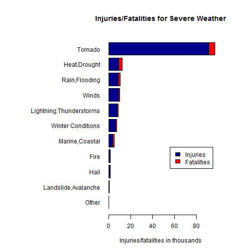
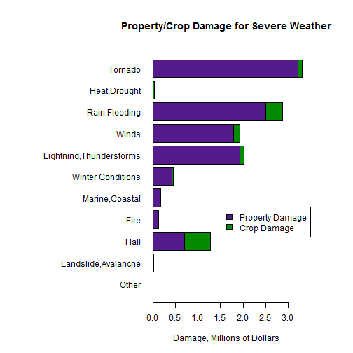
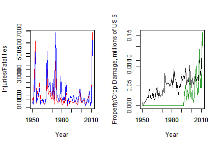

## Synopsis ##
Severe weather causes injury, death, and economic damage across the U.S. every year.  In the following analysis, we categorize the events listed in the NOAA Severe Weather data, and we summarize the damages caused by those broad categories.  Finding that tornadoes account for a comparatively large amount of damages, we investigate tornado damages further.  We find that over time, injuries and fatalities caused by tornadoes in the U.S. have decreased, but that these findings can be skewed easily by extreme events.  We also found that over time, the property and crop damages caused by tornadoes have increased.  This result is questionable, as the damages were not adjusted for inflation.
## Data Processing ##

We import the data, assuming the **.csv** file is located in the working directory.

```r
setwd("C:\\Users\\Chris\\Desktop\\Coursera Reproducible Research\\Project 2")
df <- read.csv("repdata-data-StormData.csv")
```
Next we extract only those variables of interest - injury, fatality, property damage, and crop damage - together with the factor recording event types, and variables recording the date of the event and the state the event report originated from.  

```r
x <- df[,c("FATALITIES","INJURIES","EVTYPE","PROPDMG","CROPDMG","BGN_DATE","STATE")]
x$EVTYPE <- as.factor(x$EVTYPE)
x$DATE <- lapply(x$BGN_DATE,function (z) as.Date(strsplit(as.character(z)," ")[[1]][1],"%m/%d/%Y"))
x$YEAR <- as.factor(sapply(x$DATE,function(z) format(z,"%Y")))
x$MONTH <- as.factor(sapply(x$DATE,function(z) format(z,"%b")))
x$DATE <- NULL
```
Because many recorded event types resulted in no injury or damage, we now filter our records to include only those event types which resulted in one of the four categories of injury or damage.

```r
y1<-by(x$FATALITIES,x$EVTYPE,sum)
y2<-by(x$INJURIES,x$EVTYPE,sum)
y3<-by(x$PROPDMG,x$EVTYPE,sum)
y4<-by(x$CROPDMG,x$EVTYPE,sum)
examine <- levels(x$EVTYPE)[which(y1>0 | y2>0 | y3>0 | y4>0)]
x <- x[x$EVTYPE %in% examine,]
```
Many of the event types are similar, and in particular, may differ only by minor spelling or capitalization issues in the variable name.  Thus we wish to condense our variables into broader categories.

We write two functions, the first of which is


```r
condense <- function(yy,expr,newexpr) {
  y <- yy
  y$EVTYPE <- as.factor(gsub(expr,newexpr,y$EVTYPE))
  y
}
```
which relabels all event types meeting a certain pattern (regular expression **expr**) with a specified new event category (**newexpr**).  We also write a utility function **peek** to assist with the (somewhat painstaking) process of condensing the category types.

```r
peek <- function(data,expr) {
  if (expr == "") return(levels(data$EVTYPE))
  else return(levels(data$EVTYPE)[grepl(expr,levels(data$EVTYPE))])
}
```
(To clarify: **peek** was used in the RStudio Console to help determine the expressions used in the next code block.  So although it does not appear explicitly, it was quite helpful in writing the code that is used.)

At this point we are ready to condense the event types to a few major categories.  We proceed sequentially.  Some of the expressions below are rather complex; they were written by repeatedly using **peek** to determine categories to gather together.

```r
y <- x
y <- condense(y,".*FIRE.*","Fire")
y <- condense(y,".*LANDSLI.*|.*AVALAN.*|.*Landsli.*|.*ROCK S.*|.*Mudslide.*|.*MUDSLIDE.*|.*MUD SLIDE.*","Landslide,Avalanche")
y<- condense(y,".*MARINE.*|.*Marine.*|.*HURRICANE.*|.*Hurricane.*|.*COASTAL.*|.*SURF.*|.*Surf.*|.*surf.*|.*Beach.*|.*Coastal.*|.*SEAS.*|.*TIDAL.*|.*Tidal.*|.*CURRENT.*|.*TYPHOON.*|.*ROGUE WAVE.*|.*TSUNAM.*|.*TROPICAL.*|.*STORM SURGE.*|.*FOG.*|.*WATERSPOUT.*|.*HIGH WAVES.*|.*HIGH SWELLS.*|ASTRONOMICAL HIGH TIDE|ASTRONOMICAL LOW TIDE|.*HEAVY SWELLS.*|.*HIGH TIDES.*","Marine,Coastal")
y <- condense(y,".*TORN.*|.*Tornado.*|.*FUNNEL.*","Tornado")
y <- condense(y,".*THUND.*|.*Thund.*|.*LIGHTN.*|.*THUNER.*|.*THUDER.*|LIGNTNING|LIGHTING|.*TSTMW.*","Lightning,Thunderstorms")
y <- condense(y,".*HEAT.*|.*Heat.*|.*DROUGHT.*|.WARM.*|.*WARM WEATHER.*","Heat,Drought")
y <- condense(y,".*ICE.*|.*ICY.*|.*WINT.*|.*SNOW.*|.*Snow.*|.*snow.*|.*Wint.*|.*COLD.*|.*Cold.*|.*FREEZ.*|.*Freez.*|.*BLIZZ.*|.*CHILL.*|.*MIXED PRECIP.*|.*HYPOTHERMIA.*|.*Hypothermia.*|.*HYPERTHERM.*|.*SLEET.*|.*Frost.*|.*FROST.*|HEAVY MIX|Ice jam flood.*|LOW TEMPERATURE|Mixed Precipitation","Winter Conditions")
y <- condense(y,".*RAIN.*|.*Rain.*|.*FLOOD.*|.*URBAN.*|.*Flood.*|HEAVY PRECIPITATION|HEAVY SHOWER|HIGH WATER|DOWNBURST|RAPIDLY RISING WATER","Rain,Flooding")
y <- condense(y,".*HAIL.*|.*Hail.*","Hail")
y <- condense(y,".*WIND.*|.*Wind.*|.*wind.*|.*GUST.*|.*DEVIL.*|.*Devil.*|.*DUST.*|Microburst|.*MICROBURST.*|SEVERE TURBULENCE","Winds")
y <- condense(y,"APACHE COUNTY|COOL AND WET|DAM BREAK|DENSE SMOKE|DROWNING|DRY MICROBURST|EXCESSIVE WETNESS|Glaze|GLAZE|HIGH|Landslump|LANDSPOUT|OTHER|SEICHE|VOLCANIC ASH|WET Winds|\\?","Other")
```
Now that we have condensed our data set to a few broad categories, we provide a summary table for the data (displayed in the **Results** section).

```r
summarytable <- as.data.frame(sapply(y[,sapply(y,is.numeric)],
                       function(z) by(z,y$EVTYPE,sum)))
names(summarytable) <- c("Fatalities","Injuries","Property Damage (US $)","Crop Damage (US $)")
```

## Results ##
We first summarize the results in two tables.
 
The effect of severe weather as measured by human injury and fatality:

```r
print(summarytable[,c("Injuries","Fatalities")])
```

```
##                         Injuries Fatalities
## Fire                        1608         90
## Hail                        1466         20
## Heat,Drought                9230       3138
## Landslide,Avalanche          226        269
## Lightning,Thunderstorms     7685       1019
## Marine,Coastal              3938       1202
## Other                        221          8
## Rain,Flooding               8953       1652
## Tornado                    91367       5658
## Winds                       9321        957
## Winter Conditions           6513       1132
```
The effect of severe weather as measured by property and crop damage:

```r
print(summarytable[,c("Property Damage (US $)","Crop Damage (US $)")])
```

```
##                         Property Damage (US $) Crop Damage (US $)
## Fire                                 125223.29            9565.74
## Hail                                 698199.28          585825.16
## Heat,Drought                           7331.91           35371.80
## Landslide,Avalanche                   21877.94              37.00
## Lightning,Thunderstorms             1934069.03           89366.74
## Marine,Coastal                       162929.48           19172.91
## Other                                  2626.10            1181.40
## Rain,Flooding                       2497192.25          379635.33
## Tornado                             3214733.61          100029.27
## Winds                               1794713.49          132555.86
## Winter Conditions                    425603.63           25086.11
```
The human cost (injury/fatality) of severe weather in the US is shown in the following plot.

```r
injury<-summarytable$Injuries
names(injury)<-row.names(summarytable)
fatality <- summarytable$Fatalities
names(fatality) <- row.names(summarytable)
nall<-row.names(summarytable)
nsort <- names(sort(injury[nall]+fatality[nall],decreasing=FALSE))
injury <- injury[nsort]
fatality <- fatality[nsort]
results <- rbind(injury,fatality)/1000
par(mai=c(1,3,1,1),mfrow=c(1,1))
barplot(results,horiz=TRUE,las=1,col=c("darkblue","red"),
        beside=FALSE,legend.text=c("Injuries","Fatalities"),
        args.legend = list(x=95,y=5),
        main="Injuries/Fatalities for Severe Weather",
        xlab = "Injuries/fatalities in thousands")
```

 

The economic cost (property/crop damage) of severe weather is shown in the following plot.

```r
crop<-summarytable[,"Crop Damage (US $)"]
names(crop) <- row.names(summarytable)
prop<-summarytable[,"Property Damage (US $)"]
names(prop) <- row.names(summarytable)
crop <- crop[nsort]
prop <- prop[nsort]
results <- rbind(prop,crop)/1000000
par(mai=c(1,3,1,1),mfrow=c(1,1))
barplot(results,horiz=TRUE,las=1,col=c("purple4","green4"),
        beside=FALSE,legend.text=c("Property Damage","Crop Damage"),
        args.legend = list(x=3.5,y=5),
        main="Property/Crop Damage for Severe Weather",
        xlab = "Damage, Millions of Dollars",ylab="")
```

 

## Tornado Damage ##
Because tornadoes seem to pose a much greater threat to human health and property, and because the majority of tornado damage is limited to certain geographic regions, we provide a separate analysis of tornado event data.

We begin by extracting only the tornado event data and displaying the table of the 20 states with the highest (total) fatalities due to tornado events.  (The remaining variables are roughly correlated with fatalities, and so this gives a fair overall sense of the states "hit hardest" by tornadoes.)

```r
t <- y[y$EVTYPE=="Tornado",]
ttable <- as.data.frame(sapply(t[,sapply(t,is.numeric)],
                       function(z) by(z,t$STATE,sum)))
names(ttable) <- c("Fatalities","Injuries","Property Damage (US $)","Crop Damage (US $)")
ttable[order(ttable$Fatalities,decreasing=TRUE),][1:20,]
```

```
##    Fatalities Injuries Property Damage (US $) Crop Damage (US $)
## AL        617     7929              167817.20            1652.70
## TX        538     8207              283097.24            4866.20
## MS        450     6246              188341.51           24964.20
## MO        388     4330              132229.87            2286.00
## AR        379     5116              119555.24             388.13
## TN        368     4748              112250.96             681.00
## OK        296     4829              165167.88             606.55
## IN        252     4224              104686.49             516.00
## MI        243     3362               71716.60            1513.00
## KS        236     2721              143209.88            5481.80
## IL        203     4145              128909.29            1299.30
## OH        191     4442               96546.59             388.50
## FL        186     3340              159784.69             156.00
## GA        180     3926              151349.46            3792.50
## LA        153     2637              131475.83            2844.00
## NC        126     2548               96880.19            2039.40
## KY        125     2806               73869.42            1908.00
## MA        108     1758                7113.82               0.00
## MN         99     1976               74032.64            4205.05
## WI         96     1601              111640.38           11748.47
```

We also note that damage (both human and economic) caused by tornadoes has changed over time.  In the following panel plot,

```r
timetable <- as.data.frame(sapply(t[,sapply(t,is.numeric)],
                       function(z) by(z,t$YEAR,sum)))
dates <- as.numeric(as.character(row.names(timetable)))
par(mfrow=c(1,2))
plot(dates,timetable$FATALITIES,type="l",col="red",
     xlab="Year",ylab="Injuries/Fatalities")
par(new=TRUE)
plot(dates,timetable$INJURIES,type="l",col="blue",
     xlab="",ylab="")
plot(dates,timetable$PROPDMG/1000000,type="l",col="black",
     xlab="Year",ylab="Property/Crop Damage, millions of US $")
par(new=TRUE)
plot(dates,timetable$CROPDMG/1000000,type="l",col="green4",
     xlab="",ylab="")
```

 

we see that injuries/fatalities seem to decrease over time.  This seems to be consistent with our intuition about the effects of technological advances (better communication and Doppler radar, primarily) on our ability to provide early warnings for tornadoes.  However, as we see in the graph, the relative rarity of tornadoes means that a single severe event may be enough to cause a spike.  Consider, for instance, the spike in the injury/fatality graph in 1999; this corresponds to the event on May 3, 1999, during which an F5 class tornado struck the Oklahoma City area (and incidentally, this was the first use of the new "tornado emergency" system).  For comparison, the following table shows the injuries and fatalities in the entire U.S. in the year 1999, compared to the injuries and fatalities reported in the May 3, 1999 events in Oklahoma.


```r
oneyear<-x[which(y$EVTYPE == "Tornado" & grepl(".*1999.*",y$BGN_DATE)),]
ok<-x[which(y$EVTYPE == "Tornado" & grepl("5/3/1999.*",y$BGN_DATE) & y$STATE == "OK"),]
oktable <- sapply(ok[,sapply(ok,is.numeric)],sum)
oneyeartable <- sapply(oneyear[,sapply(oneyear,is.numeric)],sum)
ptable<-paste(formatC(oktable/oneyeartable * 100,width=3),"%",sep="")
may3table <- rbind(oktable[c("INJURIES","FATALITIES")],oneyeartable[c("INJURIES","FATALITIES")],ptable[c(1,2)])
row.names(may3table) <- c("Oklahoma City OK, May 3, 1999","U.S., entire year 1999","Percentage caused by May 3 OK event")
may3table
```

```
##                                     INJURIES FATALITIES
## Oklahoma City OK, May 3, 1999       "675"    "40"      
## U.S., entire year 1999              "1842"   "94"      
## Percentage caused by May 3 OK event "42.55%" "36.64%"
```

As we see, the May 3 event makes up a large percentage of the injuries and fatalities for the entire year, accounting for the spike seen in the injuries/fatalities over time plot.  This demonstrates that these plots can be sensitive to single, extreme events; unsurprising, but worth noting.

## Conclusions ##
Severe weather causes injury, death, and economic damage across the U.S. every year.  We have provided a categorization of the events listed in the NOAA Severe Weather data, and we have summarized damages caused by those broad categories.  Finding that tornadoes account for a comparatively large amount of damages, we investigate tornado damages further.  We find that over time, injuries and fatalities caused by tornadoes in the U.S. have decreased, but that these findings can be skewed easily by extreme events.  We also found that over time, the property and crop damages caused by tornadoes have increased.  This result is questionable, as the damages were not adjusted for inflation.
